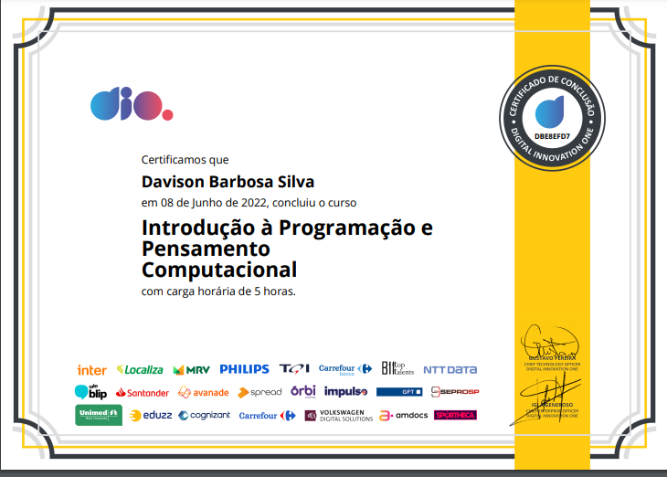
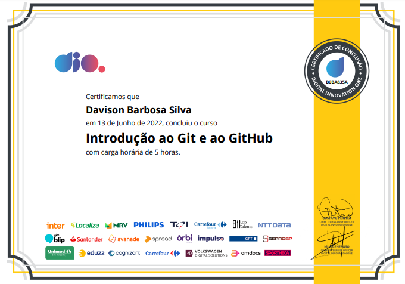
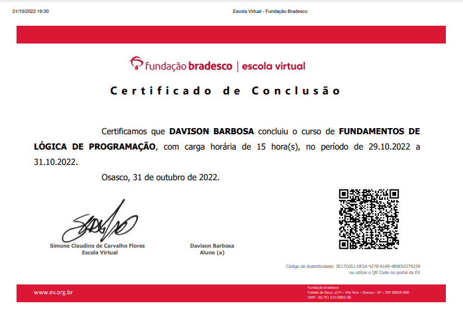
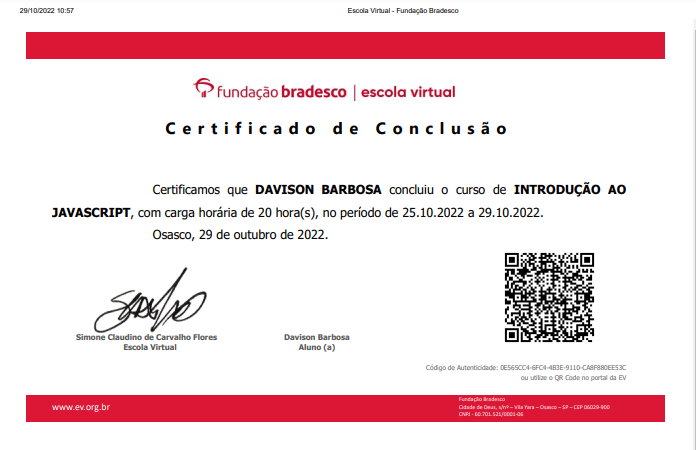
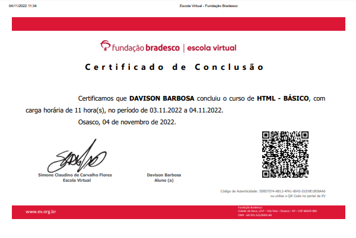
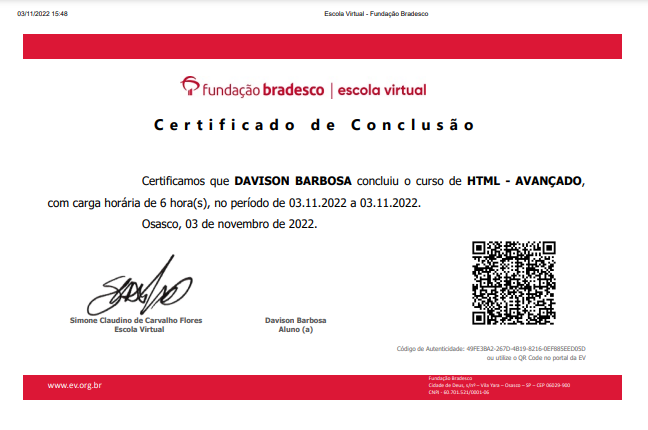
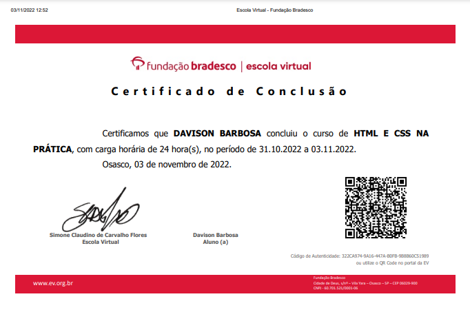

 #  Certificados 🧑🏽‍🎓
___

#### _Introdução a programação e pensamento computacional_

____
#### _Introdução Git e Github_

____
#### _Fundamentos Lógica de Programação_

___
#### _Introdução ao JavaScript_

____
#### _HTML Básico_

___
#### _HTML Avançado_

____
#### _HTML e CSS na Prática_
